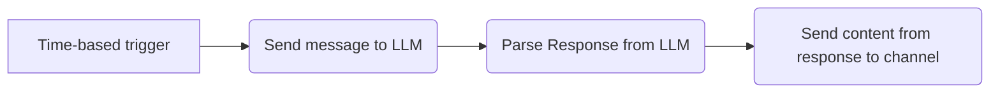
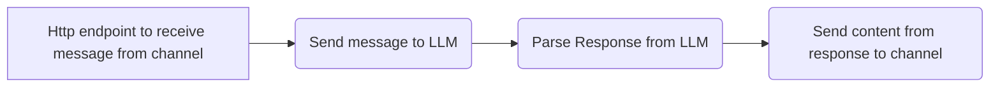

## Azure Logic Apps as a chatbot broker
This project demostrate how to use Azure Logic Apps as a chatbot broker: 
* Initiate a chatbot conversation with LLM (chatGPT) with predefined prompt
* Triggered at given time
* Send LLM response to given Microsoft team channel
* Pass response from channel to LLM with predefined prompt (along with the channel response)

## Settings
This is the code (json) of Logic App, you need to change the following settings:
* your_openai_token: replace this with your actual openai token
* channel_webhook_url: replace this with your actual webhook url from your channel (refer here for more about channel webhook: https://learn.microsoft.com/en-us/microsoftteams/platform/webhooks-and-connectors/what-are-webhooks-and-connectors)
* You need to point your outgoing webhook to url of logic-app-reciever (the actual url will be generated when logic app saved)

## Workflow diagram
### Sender

### Reciever
